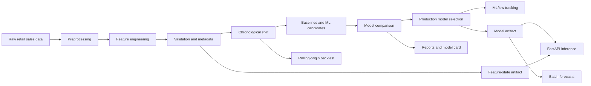

# RetailDemandML Architecture

## System Overview

RetailDemandML is organized as a batch training pipeline plus an online inference service.

## Data Contract

The preferred raw dataset format is the Kaggle Store Item Demand Forecasting schema:

| Column | Type | Meaning |
| --- | --- | --- |
| `date` | date | Daily observation date |
| `store` | integer/string | Store identifier |
| `item` | integer/string | Product identifier |
| `sales` | numeric | Units sold |

The pipeline also tolerates common alternatives such as `product`, `sku`, `demand`, and `quantity`, then normalizes them into the canonical schema.

## Module Responsibilities

- `src/config.py`: central paths and tunable defaults.
- `src/data/ingest.py`: dataset checks, local sample generation, raw-data loading.
- `src/data/validate.py`: data quality checks and Pandera schema support.
- `src/data/preprocess.py`: schema normalization, type conversion, filtering, and chronological splitting.
- `src/features/build_features.py`: lag, rolling, calendar, and categorical features.
- `src/features/feature_store.py`: historical feature-state artifact for online serving.
- `src/models/compare.py`: candidate model leaderboard.
- `src/models/train_baseline.py`: seasonal naive baseline.
- `src/models/train_xgboost.py`: production candidate model training and artifact saving.
- `src/models/tune.py`: Optuna hyperparameter tuning.
- `src/models/evaluate.py`: metric computation and report writing.
- `src/models/reports.py`: model card, sliced metrics, and prediction interval helpers.
- `src/models/explain.py`: SHAP artifact generation.
- `src/validation/backtest.py`: rolling-origin validation.
- `src/pipelines/predict_batch.py`: next-N-day batch forecasts.
- `src/api/main.py`: FastAPI app and prediction endpoint.
- `src/api/schemas.py`: Pydantic API contracts.
- `src/monitoring/drift.py`: lightweight input drift summary utilities.
- `scripts/run_pipeline.py`: end-to-end local training pipeline.

## Leakage Controls

The project avoids target leakage by:

- Sorting observations chronologically before splitting.
- Splitting by date rather than random rows.
- Creating lag and rolling features with `shift(1)` inside each store/item group.
- Fitting preprocessing encoders on training data inside scikit-learn pipelines.
- Evaluating only on future holdout periods.

## Artifact Layout

- `data/raw/`: manually added or generated raw datasets.
- `data/processed/`: cleaned datasets and feature tables.
- `models/`: trained model artifacts.
- `mlruns/`: local MLflow experiment tracking.
- `reports/`: metrics, SHAP outputs, and figures.

## Serving Design

The FastAPI service exposes a business-facing `/predict` endpoint that accepts `store`, `item`, and `forecast_date`. It builds lag, rolling, calendar, and aggregate features from the saved feature-state artifact. A lower-level `/score-features` endpoint remains available for debugging or integration with an external feature store.
