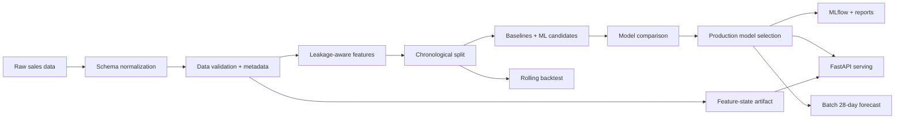
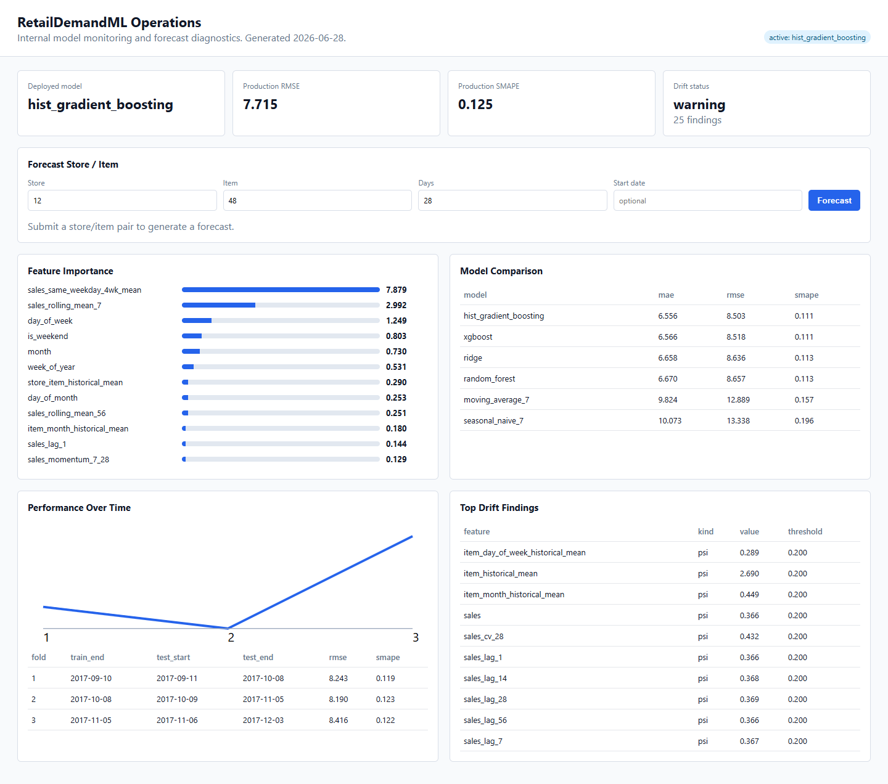
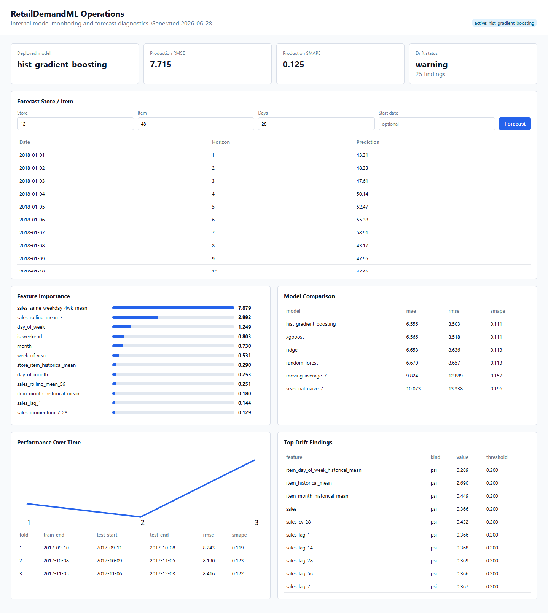

# RetailDemandML

RetailDemandML trains and serves daily store/item demand forecasts from historical retail sales. The repository contains a batch training pipeline, evaluation reports, a local model registry, batch forecast generation, and a FastAPI service for internal forecasting workflows.

The current implementation is designed for local development and reproducible experimentation. The API, Docker image, CI checks, and report artifacts are usable as engineering references, while the registry, drift checks, and monitoring dashboard are lightweight local implementations rather than managed production services.

## Current Results

Verified Kaggle Store Item Demand Forecasting run with `configs/default.yaml`:

Dataset verification:

| Rows | Stores | Items | Date Range |
| ---: | ---: | ---: | --- |
| 913,000 | 10 | 50 | 2013-01-01 to 2017-12-31 |

| Model / Split | MAE | RMSE | SMAPE |
| --- | ---: | ---: | ---: |
| Seasonal naive test | 10.07 | 13.34 | 0.196 |
| XGBoost validation | 6.57 | 8.52 | 0.111 |
| Selected production test | 5.95 | 7.71 | 0.125 |

Current selected production model on the verified Kaggle run: `hist_gradient_boosting`. XGBoost is still trained and logged as a nonlinear candidate; the serving artifact is selected by validation RMSE from trainable candidates.

Validation leaderboard:

| Model | MAE | RMSE | SMAPE |
| --- | ---: | ---: | ---: |
| HistGradientBoosting | 6.56 | 8.50 | 0.111 |
| XGBoost | 6.57 | 8.52 | 0.111 |
| Ridge | 6.66 | 8.64 | 0.113 |
| RandomForest | 6.67 | 8.66 | 0.113 |
| Moving average 7 | 9.82 | 12.89 | 0.157 |
| Seasonal naive 7 | 10.07 | 13.34 | 0.196 |

## Capabilities

- Uses chronological train/validation/test splits and rolling-origin backtests.
- Compares a seasonal baseline, moving average baseline, linear model, tree ensembles, and XGBoost.
- Validates the raw sales schema, writes dataset metadata, and records whether the local file matches the expected Kaggle training set.
- Builds lag, rolling, calendar, holiday, and historical aggregate features with shifted target-derived inputs.
- Saves a feature-state artifact so `/predict` can accept `store`, `item`, and `forecast_date` without requiring callers to construct lag features.
- Writes model comparison, sliced error, drift, feature-importance, and model-card reports from the same training artifacts used by the service.
- Runs `ruff`, `mypy`, and `pytest` through local commands and GitHub Actions.

## Dataset

Preferred dataset: Kaggle Store Item Demand Forecasting Challenge.

Place Kaggle `train.csv` at:

```text
data/raw/train.csv
```

Canonical schema:

```text
date, store, item, sales
```

The project also supports local sample data:

```bash
make sample-data
```

Sample data is written to `data/raw/sample_train.csv` so it cannot overwrite the canonical Kaggle file at `data/raw/train.csv`.

If the Kaggle CLI is configured, start a download with:

```bash
make data
```

Verify that `data/raw/train.csv` is the full real Kaggle dataset, not the local sample file:

```bash
make verify-real-data
```

This writes `reports/real_data_verification.json` and `reports/real_data_verification.md`. The expected Kaggle training file has about 913,000 rows, 10 stores, 50 items, and dates from 2013-01-01 to 2017-12-31. Sample mode remains useful for CI and smoke tests, but public README metrics should come from verified Kaggle data.

## Commands

```bash
make setup         # install package and dev tooling
make data          # download and unzip Kaggle data when Kaggle CLI is configured
make data-metadata # write dataset hash and profile metadata
make verify-real-data # verify raw train.csv is the full Kaggle dataset
make sample-data   # generate reproducible local sample data at data/raw/sample_train.csv
make eda           # generate EDA report and visualization artifacts
make features-doc  # write feature dictionary
make drift         # generate drift report from feature data
make train         # train, compare, backtest, select, and report on real Kaggle data
make train-sample  # smoke-test the pipeline on generated sample data
make evaluate      # evaluate saved predictions
make backtest      # run rolling-origin backtest on real Kaggle data
make backtest-sample # run rolling-origin backtest on generated sample data
make predict-batch # forecast the next 28 days for every store/item
make register      # register current production artifact as a candidate
make promote       # promote candidate if it beats champion rules
make registry      # show active registry status
make tune          # run Optuna search for XGBoost on real Kaggle data
make tune-sample   # run Optuna search on generated sample data
make explain       # create SHAP summary plot
make serve         # start FastAPI service
make lint          # ruff
make typecheck     # mypy
make test          # pytest
make ci            # lint + test
```

## Architecture



Key modules:

- `src/data/ingest.py`: sample generation, raw loading, Kaggle CLI hook, dataset metadata.
- `src/data/validate.py`: data-quality checks and Pandera schema support.
- `src/features/build_features.py`: calendar, holiday, lag, rolling, and historical features.
- `src/features/feature_store.py`: saved historical state for serving-time feature generation.
- `src/models/compare.py`: Ridge, HistGradientBoosting, RandomForest, moving average comparison.
- `src/models/registry.py`: local champion/challenger registry and promotion workflow.
- `src/models/train_xgboost.py`: XGBoost candidate with MLflow logging.
- `src/reports/eda.py`: reproducible EDA report and visualization generator.
- `src/monitoring/drift.py`: PSI, mean-shift, missingness, and categorical drift reports.
- `src/validation/backtest.py`: rolling-origin backtesting.
- `src/pipelines/predict_batch.py`: multi-day batch forecasting.
- `src/api/main.py`: FastAPI inference.

## API

Train first:

```bash
make train
make serve
```

Business prediction:

```bash
curl -X POST http://localhost:8000/predict \
  -H "Content-Type: application/json" \
  -d '{"store":"1","item":"1","forecast_date":"2023-01-01"}'
```

Low-level feature scoring remains available at `/score-features` for debugging and integration with an external feature store.

Interactive API docs:

```text
http://localhost:8000/docs
http://localhost:8000/redoc
```

The `/health` endpoint reports registry status, active model metadata, and whether the model and feature-state artifacts are loadable.

## Internal ML Operations Dashboard

Open the internal dashboard after training:

```text
http://localhost:8000/dashboard
```

The dashboard is intentionally an internal ML operations surface, not a customer product. It answers:

- What model is currently deployed?
- How accurate is it?
- What features matter most?
- How has performance changed across backtest folds?
- Which drift findings need attention?
- What is the next 28-day forecast for a selected store/item?

Dashboard overview:



Store/item forecast workflow:



## Explainability

The dashboard uses `reports/feature_importance.csv` as the production-facing feature importance artifact. For the selected `hist_gradient_boosting` production model, this is generated with permutation importance because the promoted sklearn pipeline does not expose SHAP values in the same direct way as the XGBoost candidate.

SHAP support remains available through `make explain` for compatible tree models, especially the XGBoost candidate. In other words:

- Production dashboard: permutation/native feature importance for the promoted model.
- Candidate deep dive: SHAP summary for compatible tree-based candidates.

## Artifacts

The files under `reports/` are generated by the pipeline and are kept in the repository when they are small enough to review. They are intended to make a run auditable: dataset verification explains which raw file was used, `model_comparison.csv` and `backtest_results.csv` explain model selection, `feature_importance.csv` powers the dashboard, and `model_card.md` summarizes the current trained artifact. Large raw data, processed feature tables, model binaries, and MLflow runs remain ignored.

```text
models/production_model.joblib
models/xgboost_model.joblib
models/feature_store.joblib
reports/metrics.json
reports/model_comparison.csv
reports/backtest_results.csv
reports/sliced_metrics.csv
reports/model_card.md
reports/data_metadata.json
reports/eda_summary.json
reports/eda_report.md
reports/feature_dictionary.md
reports/drift_report.json
reports/drift_summary.csv
reports/drift_report.md
reports/figures/*.png
data/processed/predictions.csv
data/processed/forecast_next_28_days.csv
models/registry/model_registry.json
models/registry/promotions.jsonl
models/registry/production/production_model.joblib
mlruns/
```

## Production Considerations

- Retraining should run after new daily sales land and pass validation.
- Feature freshness matters: serving predictions depend on the saved feature-state artifact.
- Cold-start store/item pairs fall back to aggregate and global history.
- The local registry promotes a challenger only when it beats the configured champion metric threshold.
- Drift monitoring reports PSI, standardized mean shifts, missing-rate changes, and unseen categorical levels.
- Production monitoring should also track forecast error by store/item and calibration of prediction intervals.

## Known Limitations

- The public Kaggle dataset does not include real price, promotion, stockout, or inventory signals. Retail demand is strongly affected by those drivers, so the current model relies on historical demand, calendar effects, holidays, and store/item hierarchy features instead.
- Optional columns for `price`, `promotion_flag`, `stockout_flag`, and `inventory_on_hand` are supported by the feature pipeline, but they are placeholders unless an external business data source is added.
- The local model registry is intentionally lightweight; it provides champion/challenger behavior but is not a managed production registry service.
- Drift monitoring is batch artifact-based. It does not yet include scheduled alert routing or a live prediction/error feedback loop.

## Docker

```bash
docker compose up --build
```

The API image runs as a non-root user, includes a container healthcheck, and expects trained artifacts mounted from `models/`, `data/`, and `reports/`.
